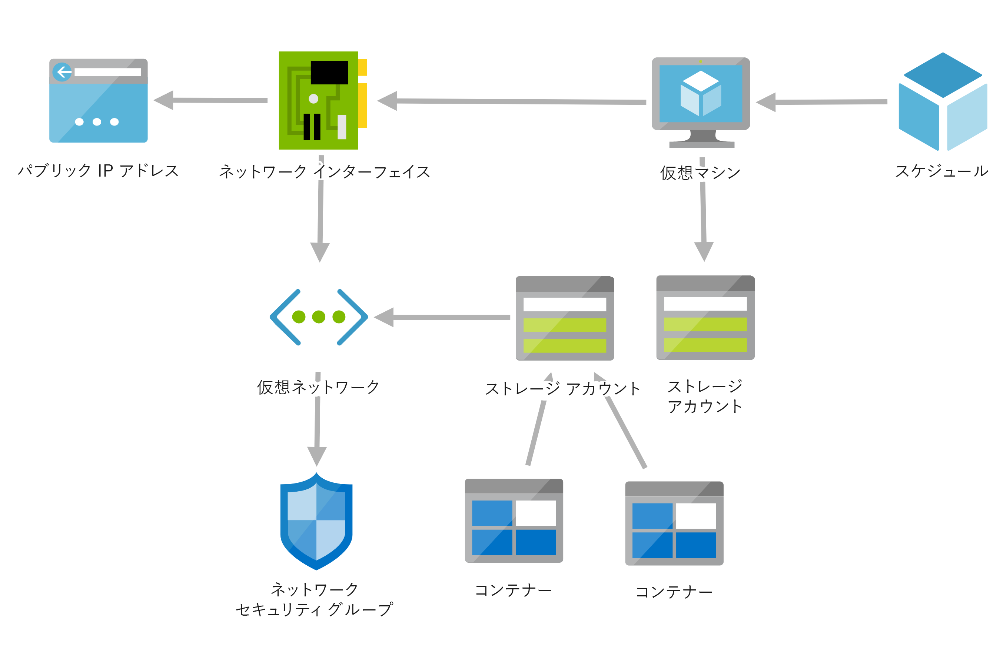

# <a name="pubsub-and-network-integration"></a>Pub/Sub とネットワークの統合

## <a name="process-diagram"></a>プロセス図


## <a name="overview"></a>概要

この課題の主な目的は、参加者に対して次の概念を明らかにすることにあります。

* 仮想ネットワーク統合を含む Azure Functions Premium
* Azure Service Bus のトピックとサブスクリプション フィルター (追加のアクションを必要とする、イベントのフィルター処理) を介した Pub/Sub
* メッセージング要求のチェック パターン

## <a name="happy-path"></a>ハッピー パス

* 参加者は、メッセージの送信先となる新しい Service Bus トピックを作成する必要があります。
* Service Bus は、"pub-sub-messages" サブネットを使用して既存の VNet に接続されているプライベート エンドポイントを用いて構成する必要があります。
* 前の課題で使用した Azure 関数を変更して、イベント ハブから受信したデータに ```receiptUrl``` がある場合に **のみ**、新しい Service Bus トピックにメッセージが公開されるようにします。
    * Service Bus メッセージ型または BrokeredMessage 型の UserProperties を使用します。 新しいプロパティには、"TotalCost" などのキーと 134.59 などの値を指定する必要があります。  プロパティは、サブスクリプションの Service Bus SQL フィルターで使用できます。
    * C# を使用する場合は、出力バインディングを使用できます。
    * JavaScript または Java を使用する場合は、Azure SDK を使用します。  バインディングは機能しません (UserProperty は使用できず、メッセージの一部としてシリアル化されます)。  JavaScript の例については、[こちら](https://docs.microsoft.com/azure/service-bus-messaging/service-bus-nodejs-how-to-use-topics-subscriptions-new-package#send-messages-to-a-topic)を参照してください。  これは既知の問題です ([こちら](https://github.com/Azure/azure-webjobs-sdk/issues/2137)と[こちら](https://github.com/Azure/Azure-Functions/issues/1139)を参照してください)。
    * まだ存在しない場合は、Azure Functions をエラスティック Premium にアップグレードします
    * "sale-processing" サブネットを使用して接続し、サービス バスへの接続を許可するように Azure 関数を構成します
* 2 つの Service Bus サブスクリプションを作成します。1 つはすべてのメッセージを処理し、もう 1 つは合計コストが $100 を超えるメッセージのみを処理します。  
    * **注:** サブスクリプションにフィルターを追加するには、ポータルでサブスクリプションを作成してから、サブスクリプションの編集ブレードを使用します。 また、ARM テンプレート ([こちら](https://github.com/Azure/azure-quickstart-templates/blob/master/201-servicebus-create-topic-subscription-rule/azuredeploy.json)または[こちら](https://docs.microsoft.com/azure/service-bus-messaging/service-bus-resource-manager-namespace-topic-with-rule))、[Azure CLI](https://docs.microsoft.com/cli/azure/servicebus/topic/subscription/rule?view=azure-cli-latest)、コード (Azure SDK)、または [Service Bus Explorer](https://github.com/paolosalvatori/ServiceBusExplorer) を用して作成することもできます。
* サブスクライバーとして機能する 2 つの関数を (Functions Premium プラン内に) 作成します。  サブスクリプションごとに 1 つの関数が必要です。
* PDF を取得して base64 でエンコードする関数の場合:
    * Service Bus トリガーを使用してメッセージを受信します
    * BLOB 出力バインディングと[ランダム GUID 用 BLOB 出力バインディング](https://docs.microsoft.com/azure/azure-functions/functions-bindings-expressions-patterns#create-guids)を使用して、ファイル名を設定します
    * receiptUrl は、SAS URL を使用した Azure ストレージ BLOB への参照である必要があります。したがって、Azure 関数内でダウンロードできる必要があります。
    * "receipt-processing" サブネットを使用してサービス バスへの接続を許可するように構成されます。
* 提供された VM を使用して、Azure BLOB ストレージ内のファイルを表示し、メッセージがサービス バスに送信されていることを確認します。  (Azure Bastion を使用して) VM にリモート アクセスし、Azure portal にログインします (OpenHack に Azure 資格情報を使用)。  ポータルで Storage Explorer に移動し、[参照] をクリックして BLOB ストレージ内のファイルを表示します。

## <a name="coachs-notes"></a>コーチのメモ

* VM (ジャンプボックス) に関するメモ
    * Azure Bastion を使用してジャンプボックスに接続します
    * *ユーザー名:* serverless
    * *パスワード:* Serverless4All!
    * 毎日 19:00 UTC に VM が自動的にシャットダウンされます
* 次の Azure リソースは、参加者の Azure サブスクリプション内で事前にプロビジョニングしておく必要があります。
    * 2 つのストレージ アカウント
        * VM の診断データ用に 1 つ (ストレージ アカウント名は "sohvmdiag" で始める必要があります)
        * 領収書のストレージ用に 1 つ (ストレージ アカウント名は "sohsales" で始める必要があります)。  このストレージ アカウント内には、"receipts" と "receipts-high-value" という 2 つのコンテナーが必要です
    * 1 台の仮想マシン ("soh-jumpbox")
        * OS は Windows 10
        * VM は DevTestLab スケジュールを使用して、毎日 19:00 に自動的にシャットダウンします (通知はなし)
    * 1 つの Azure Bastion ホスト
    * 1 つの仮想ネットワーク ("soh-vnet")
        * 4 つのサブネット
            * "receipt-processing" - これは、この課題のサービス バスからのメッセージを処理するために使用されるコンピューティング リソース (Azure Functions Premium プランを推奨) で使用されます
            * "sale-processing" - これは、前の課題のイベント処理サービスを更新してサービス バスにプッシュするために使用されるコンピューティング リソース (Azure Functions Premium プランを推奨) によって使用されます
                * ハッカーが、同じ App Service プランを使用するように両方の関数を構成している場合、両方とも同じ構成になるため、上記のいずれのサブネットも使用することができます
            * "pub-sub-messages" - これは、プライベート エンドポイントを構成するサービス バスによって使用されます
            * "jumpbox" - これは、VM によって排他的に使用されます
            * "AzureBastionSubnet" - これは、ジャンプボックスに接続するために Azure Bastion ホストによって使用されます
        * receipt-processing サブネットには、Microsoft.Storage リソースにアクセスするための仮想ネットワーク サービス エンドポイントが構成されています。
        * Azure Bastion 経由でジャンプボックスにアクセスできるようにする 1 つのネットワーク セキュリティ グループ

次の図は、各チームの Azure サブスクリプションに対して作成される Azure リソースを示したものです。



## <a name="why-service-bus-functions-virtual-machines-and-storage-accounts"></a>Service Bus、Functions、Virtual Machines、およびストレージ アカウントを使用する理由

### <a name="service-bus"></a>Service Bus

* メッセージ キューおよび Pub/Sub 機能を備えたフルマネージド エンタープライズ メッセージ ブローカー
* 負荷分散、セキュリティで保護されたルーティング、境界を越えたデータの転送と制御、高い信頼性でのトランザクション処理の調整を行うために、アクションとサービスを相互に分離します

### <a name="azure-functions"></a>Azure Functions

* Azure 関数を使用すると、チームで記述するコードと保守するインフラストラクチャを減らすことができるため、コストを節約できます
* Azure 関数は、軽量でスタンドアロンです。  関数を使用すると、モノリシックなアプリケーションを簡単に分割し、リード時間またはサイクル時間を短縮できます。これにより、チームはより迅速かつ効率的にコードを運用環境に移行できます

### <a name="azure-virtual-machines"></a>Azure Virtual Machines

* オンデマンドでスケーラブルなコスト効率のよいコンピューティング
* ハードウェアの管理が不要となり、ネットワークとアクセス、OS、ディスク、およびプロセッサ構成 (コア数や処理能力など) を完全に制御できます

### <a name="azure-storage"></a>Azure Storage

* ストレージは耐久性、拡張性、高可用性を備えています。 一時的なハードウェア障害が発生した場合でも冗長性によってデータの安全性が保証される一方、現在のアプリケーションのニーズに対応できるように大幅に拡張できます
* 組み込みの暗号化ときめ細かなアクセス制御を通じて、ユーザーにアクセスを許可する必要があるストレージ データのみが公開されるように、詳細かつ厳密なアクセス権を構成することができるため、ストレージはセキュリティで保護されます。
